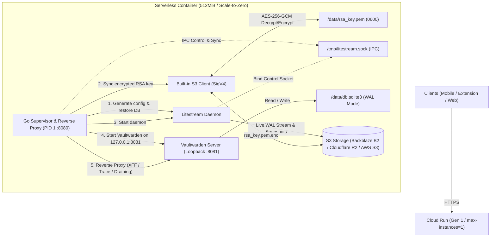

# vaultwarden-serverless

[](https://github.com/kdh-rsch/vaultwarden-serverless/actions/workflows/docker-publish.yml)
[](https://www.gnu.org/licenses/agpl-3.0)

Self-hosted [Vaultwarden](https://github.com/dani-garcia/vaultwarden) on **Google Cloud Run** with **$0.00/month operating cost**, using the Cloud Run Free Tier and S3-compatible object storage ([Backblaze B2](https://www.backblaze.com/b2/cloud-storage.html) / [Cloudflare R2](https://www.cloudflare.com/developer-platform/r2/)).

---

## Highlights

- **Embedded Reverse Proxy & Probes:** Binds public port `8080` immediately upon container start. Buffers incoming requests during cold starts to prevent `502 Bad Gateway`, exposes `/healthz` (liveness) and `/ready` (readiness) endpoints, and drains in-flight requests before shutdown.
- **Explicit Sync Verification:** On Cloud Run scale-to-zero (`SIGTERM`), the supervisor stops Vaultwarden to freeze SQLite writes, triggers `litestream sync -wait` over IPC control socket, programmatically verifies remote S3 commit confirmation (`replica_txid == txid`), and tears down the daemon.
- **Fail-Closed Durability:** If database restore fails on startup or if the Litestream replication daemon crashes during runtime, the container halts immediately (`exit 1`) to prevent data divergence and empty database overwrites.
- **Non-Root Execution & Hardened Defaults:** Runs under unprivileged UID/GID `1000:1000` with master password hints and public registration disabled by default.
- **Strict Host Validation & Token Redaction:** Rejects unauthorized `Host` header scanning with `403 Forbidden` and automatically redacts `access_token` and sensitive query parameters from access logs.
- **Unified Structured slog & Cloud Trace:** Parses and correlates logs from Vaultwarden, Litestream, and the Supervisor into unified JSON `slog` entries for Google Cloud Logging, integrating `logging.googleapis.com/trace` from `X-Cloud-Trace-Context`.
- **Client IP Sanitization (XFF):** Sanitizes `X-Forwarded-For` and sets clean `X-Real-IP` headers so Vaultwarden rate-limiting and brute-force protection receive accurate client IPs without proxy hop confusion.
- **Persistent Sessions (Zero-Config RSA):** Generates a 2048-bit RSA key on initial boot, encrypts it via AES-256-GCM, and persists it in your S3 bucket. Mobile and browser extension sessions stay logged in across cold starts without manual key configuration.
- **Static Supervisor Binary:** Supervisor is compiled with `CGO_ENABLED=0` using the latest stable Go toolchain with zero external runtime dependencies.

---

## Architecture



---

## Quick Start

### 1. Prerequisites

1. **S3-compatible Bucket:** Create a private bucket in [Backblaze B2](https://www.backblaze.com/b2/cloud-storage.html) or [Cloudflare R2](https://www.cloudflare.com/developer-platform/r2/).
   - Obtain your **Bucket Name**, **S3 Endpoint** (e.g. `s3.us-west-004.backblazeb2.com`), **Access Key ID**, and **Secret Access Key**.
2. **GCP Project:** Enable Cloud Run in your Google Cloud account:
   ```bash
   gcloud services enable run.googleapis.com
   ```

### 2. Deploy to Cloud Run

Replace the environment variables below with your credentials and run:

```bash
# 1. (Optional for updates) Taint active revision to freeze writes and flush S3
# curl -s -f -X POST "https://YOUR_SERVICE_URL/_supervisor/taint" -H "Authorization: Bearer YOUR_SECRET_KEY"

# 2. Deploy new revision without routing traffic (prevents concurrent Litestream writers)
gcloud run deploy vaultwarden \
  --image="ghcr.io/kdh-rsch/vaultwarden-serverless:latest" \
  --region="us-west1" \
  --platform="managed" \
  --allow-unauthenticated \
  --execution-environment="gen1" \
  --memory="512Mi" \
  --cpu="1" \
  --min-instances="0" \
  --max-instances="1" \
  --concurrency="80" \
  --timeout="60s" \
  --port="8080" \
  --no-traffic \
  --startup-probe="httpGet.path=/ready,httpGet.port=8080,periodSeconds=2,failureThreshold=20" \
  --liveness-probe="httpGet.path=/healthz,httpGet.port=8080,periodSeconds=10" \
  --set-env-vars="REPLICA_BUCKET=your-bucket-name" \
  --set-env-vars="REPLICA_ENDPOINT=s3.us-west-004.backblazeb2.com" \
  --set-env-vars="LITESTREAM_ACCESS_KEY_ID=your-access-key-id" \
  --set-env-vars="LITESTREAM_SECRET_ACCESS_KEY=your-secret-access-key" \
  --set-env-vars="SIGNUPS_ALLOWED=true" \
  --set-env-vars="WEBSOCKET_ENABLED=false"

# 3. Atomically shift 100% of live traffic to the latest revision
gcloud run services update-traffic vaultwarden \
  --region="us-west1" \
  --to-latest
```

> [!IMPORTANT]
> - `--max-instances=1` is **strictly required** to prevent concurrent write conflicts on SQLite.
> - Once you have registered your initial account, disable open registrations:
>   ```bash
>   gcloud run services update vaultwarden --region="us-west1" --update-env-vars="SIGNUPS_ALLOWED=false"
>   ```

---

## Configuration Reference

### Storage Credentials (Required)

| Variable | Description | Example |
|---|---|---|
| `REPLICA_BUCKET` | Target S3/B2 bucket name | `my-vault-backups` |
| `REPLICA_ENDPOINT` | S3-compatible host without protocol | `s3.us-west-004.backblazeb2.com` |
| `LITESTREAM_ACCESS_KEY_ID` | Storage access key ID / B2 KeyID | `0042abcd1234...` |
| `LITESTREAM_SECRET_ACCESS_KEY` | Storage secret access key / B2 ApplicationKey | `K004...` |

### Session & Cryptography (Optional)

| Variable | Default | Description |
|---|---|---|
| `RSA_PASSPHRASE` | `""` | Passphrase used to derive the AES-256-GCM encryption key for the backup `rsa_key.pem.enc` in S3. If omitted, it is automatically derived from `LITESTREAM_SECRET_ACCESS_KEY`. |
| `RSA_PRIVATE_KEY_PEM` | `""` | Optional pre-existing 2048-bit RSA private key in PEM format. If not provided, a new key is generated on first run and backed up to S3. |

### Replication & Supervisor (Optional)

| Variable | Default | Description |
|---|---|---|
| `REPLICA_PATH` | `vaultwarden-db` | Root folder path inside the bucket for database files and encrypted keys. |
| `REPLICA_REGION` | Auto-detected | S3 region. Inferred automatically from endpoint (e.g. `us-west-004` for B2, `auto` for R2). |
| `DB_PATH` | `/data/db.sqlite3` | Local container path for SQLite database. |
| `DATA_FOLDER` | `/data` | Local container path for Vaultwarden data. |
| `SYNC_INTERVAL` | `1s` | Interval between Litestream WAL replication checks. |
| `SNAPSHOT_INTERVAL` | `12h` | Interval between full database snapshot uploads. |
| `RETENTION` | `168h` (7 days) | Point-in-time recovery (PITR) retention window. |
| `STARTUP_TIMEOUT` | `30s` | Maximum duration the reverse proxy buffers incoming requests while waiting for Vaultwarden to initialize during cold starts. |
| `SHUTDOWN_TIMEOUT` | `10s` | Maximum grace period for graceful teardown (Vaultwarden drain + explicit sync + daemon shutdown). |
| `STRICT_HOST` | `false` | When `true`, enforces strict Host header matching against `DOMAIN` (blocks raw IP / Shodan scanner requests with 403). |
| `ALLOWED_HOSTS` | `""` | Comma-separated whitelist of allowed Host headers (e.g. `vault.example.com`). Automatically enables strict host checking. |
| `LITESTREAM_SOCKET_PATH` | `/tmp/litestream.sock` | Path to Unix domain socket for IPC control and explicit sync verification. |

### Common Vaultwarden Features

| Variable | Default | Description |
|---|---|---|
| `DOMAIN` | `""` | Base URL of your vault (e.g. `https://vault.example.com`). Required for WebAuthn, Passkeys, and invite tokens. |
| `SIGNUPS_ALLOWED` | `true` | Allows new user registration. Set to `false` after initial setup. |
| `INVITATIONS_ALLOWED` | `true` | Allows inviting users even when signups are disabled. |
| `SHOW_PASSWORD_HINT` | `false` | Shows master password hint on login page. |
| `ADMIN_TOKEN` | `""` | Access token for the `/admin` portal. **Recommended:** Argon2 PHC string (generated via `docker run --rm -it vaultwarden/server:latest /vaultwarden hash`). See [Operations Guide](docs/OPERATIONS.md#9-admin-token-security--argon2-phc-hashes). |
| `WEBSOCKET_ENABLED` | `false` | Keep `false` on serverless. WebSockets prevent scale-to-zero. |

### Real-Time Push Notifications (Serverless-Friendly Sync)

Replaces persistent WebSockets with official Bitwarden push notifications (iOS/Android) via Apple APNs and Google FCM. See [Operations Guide](docs/OPERATIONS.md#1-real-time-push-notifications) for details.

| Variable | Default | Description |
|---|---|---|
| `PUSH_ENABLED` | `false` | Set to `true` to enable push notifications. |
| `PUSH_INSTALLATION_ID` | `""` | Installation ID from [bitwarden.com/host](https://bitwarden.com/host/). |
| `PUSH_INSTALLATION_KEY` | `""` | Installation Key from [bitwarden.com/host](https://bitwarden.com/host/). |
| `PUSH_RELAY_URI` | `https://push.bitwarden.com` | Push relay endpoint (`https://push.bitwarden.eu` for EU accounts). |

### SMTP & Email Alerts (Optional)

Enables new device login alerts, email 2FA verification codes, and password hints.

| Variable | Default | Description |
|---|---|---|
| `SMTP_HOST` | `""` | SMTP server host (e.g. `smtp.gmail.com`, `smtp-relay.brevo.com`). |
| `SMTP_FROM` | `""` | Sender address (e.g. `vault@example.com`). |
| `SMTP_PORT` | `587` | Port (`587` for STARTTLS, `465` for SSL). |
| `SMTP_SECURITY` | `starttls` | Encryption mode: `starttls`, `force_tls`, or `off`. |
| `SMTP_USERNAME` | `""` | SMTP username. |
| `SMTP_PASSWORD` | `""` | SMTP password or App Password. |

### Logging (Optional)

| Variable | Default | Description |
|---|---|---|
| `LOG_FORMAT` | `json` | Structured output format: `json` (for GCP Cloud Logging) or `text`. |
| `LOG_LEVEL` | `INFO` | Minimum log severity filter: `DEBUG`, `INFO`, `WARN`, `ERROR`. |

---

## Operations & Disaster Recovery

For complete runbooks, disaster recovery procedures, and operational guides, see **[docs/OPERATIONS.md](docs/OPERATIONS.md)**:

- **[Disaster Recovery & Local Database Restore](docs/OPERATIONS.md#2-disaster-recovery--local-database-restore)**: Extracting and inspecting SQLite backups locally from S3 using `litestream restore`.
- **[Point-in-Time Recovery (PITR)](docs/OPERATIONS.md#3-point-in-time-recovery-pitr)**: Restoring to an exact second in case of accidental deletions.
- **[Decrypting Remote RSA Keys Locally](docs/OPERATIONS.md#4-decrypting-remote-rsa-keys-locally)**: Python script to decrypt `rsa_key.pem.enc` on your workstation.
- **[WebAuthn, Passkeys & Custom Domains](docs/OPERATIONS.md#5-webauthn-passkeys--custom-domains)**: Setting `DOMAIN` prior to registering hardware security keys.
- **[Safe Zero-Conflict Deployments](docs/OPERATIONS.md#6-safe-zero-conflict-deployments)**: Deploying revisions without overlapping Litestream writers.
- **[Ephemeral Storage Notice](docs/OPERATIONS.md#8-data-durability--ephemeral-storage-limitations)**: Reminders regarding file attachments on ephemeral serverless disks.
- **[Admin Token Security (Argon2)](docs/OPERATIONS.md#9-admin-token-security--argon2-phc-hashes)**: Hardening the `/admin` portal with cryptographic Argon2id PHC hashes.
- **[Subpath / Subdir Deployment](docs/OPERATIONS.md#10-subpath--subdir-deployment-defense-in-depth)**: Hosting Vaultwarden under an obscure path to hide from public scanners.
- **[Strict Host Validation](docs/OPERATIONS.md#11-strict-host-validation--scanner-mitigation)**: Blocking raw IP and unauthorized host requests with 403 Forbidden.
- **[Non-Root Security](docs/OPERATIONS.md#12-non-root-container-security)**: Unprivileged UID 1000 container isolation and automatic access token log redaction.

---

## Secrets Management

For production environments, prefer storing sensitive values in **GCP Secret Manager** rather than plain environment variables:
```bash
gcloud run deploy vaultwarden \
  --set-secrets="LITESTREAM_SECRET_ACCESS_KEY=my-b2-secret:latest" \
  ...
```

---

## License

This project is licensed under the [GNU AGPLv3](LICENSE).

